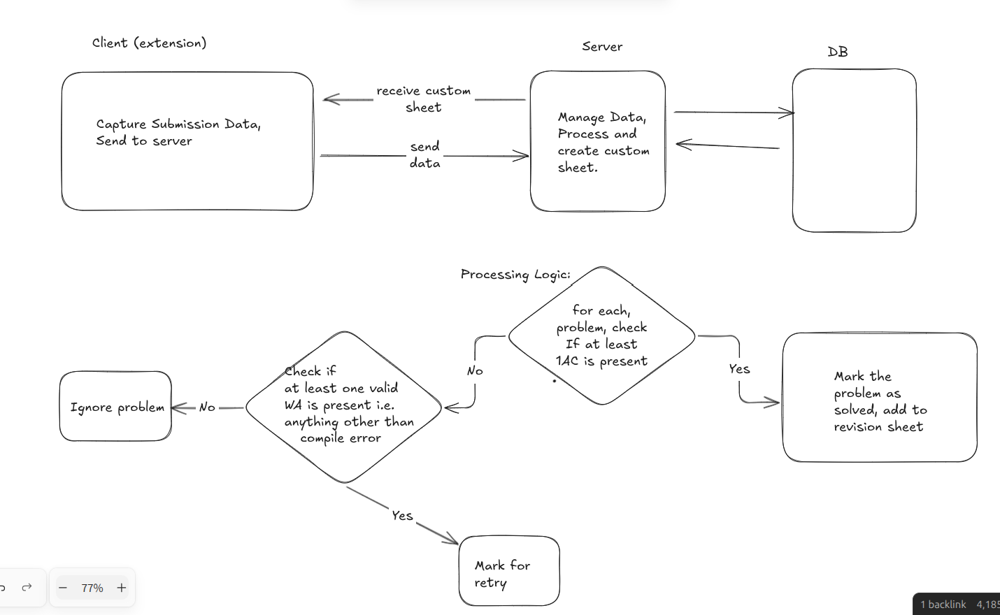

# LeetCode AutoRevise

An extension and service that aims to capture your leetcode submission data in the background as and when you use leetcode, and , aims to compile and present it to you in form of weekly revision sheets, all on its own, removing the need of manual problem tracking.

## Example of Submission Data Captured :


```js
{
    //other stuff
    raw: {
        code_output: "",
        compare_result: "111111111111111111111111111111111111111111111111111111111111111",
        display_runtime: "4",
        elapsed_time: 21,
        expected_output: "",
        finished: true,
        lang: "cpp",
        last_testcase: "",
        memory: 14980000,
        memory_percentile: 20.337000000000003,
        pretty_lang: "C++",
        question_id: "1",
        run_success: true,
        runtime_percentile: 56.96030000000002,
        state: "SUCCESS",
        status_code: 10,
        status_memory: "15 MB",
        status_msg: "Accepted",
        status_runtime: "4 ms",
        std_output: "",
        submission_id: "1758634237",
        task_finish_time: 1756927711651,
        task_name: "judger.judgetask.Judge",
        total_correct: 63,
        total_testcases: 63
    }
}
```

## MVP Description

A simple server to store and manage data using MongoDB. Process it according to the flow below and show it to the user in the extension's UI itself.



## Development (React Sidepanel)

The sidepanel has been migrated to a React app (Vite) located in `extension/ui`.

Workflow:

1. Install deps:
    ```bash
    cd extension/ui
    npm install
    ```
2. Develop (hot reload in browser via normal extension reload still required):
    ```bash
    npm run dev
    ```
    This serves the UI separately (not loaded by the extension). Use it for rapid iteration, then build.
3. Build & sync into extension root:
    ```bash
    npm run build
    ```
    This outputs production assets and copies them into `extension/sidepanel.html` plus `extension/sidepanel_assets/`.
4. Reload the extension in Chrome (chrome://extensions) to see updates.

Notes:
* The built `sidepanel.html` is produced by Vite; edit React code then rebuild.
* Legacy files (`sidepanel.js`, `sidepanel.css`) were removed after React migration.
* Messaging & storage access work the same via the Chrome Extension APIs inside React components.

## Future Improvements
* Add state management (e.g. Zustand) for problem tracking.
* Add revision scheduling visualization.
* Add options page for configuration.
